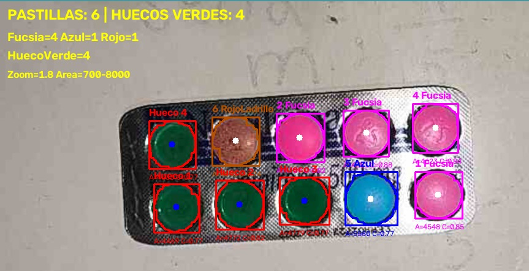
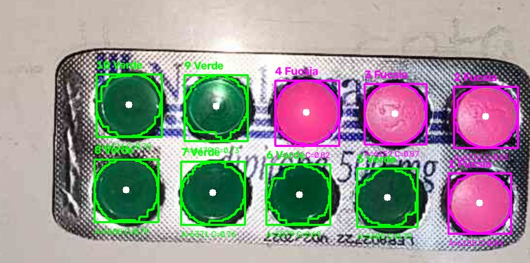

#  Inspección de Blísters y Control de Calidad con Visión Computacional
| Detección | Inspección / Resultado Final |
| :---: | :---: |
|  |  |


Sistema integral de **Visión Computacional y Procesamiento Digital de Imágenes** enfocado en la inspección automatizada, clasificación y control de calidad de blísters farmacéuticos. Integra referencia espacial con **Marcadores ArUco**, algoritmos de segmentación/clasificación y generación automática de reportes de inspección en Excel.

---

##Características Principales del Sistema

* **Referenciación Espacial con Marcadores ArUco:** Detección de marcadores para calibración de cámara, corrección de perspectiva (*warp perspective*) y delimitación precisa de la Región de Interés (ROI).
* **Detección y Segmentación de Cavidades:** Localización automática de cada celdilla del blíster e identificación de la presencia o ausencia de pastillas.
* **Clasificación de Calidad:** Evaluación de comprimidos completos, incompletos o ausentes mediante análisis  de contornos.
* **Adquisición en Tiempo Real (`test_camera.py`):** Módulo para captura con apk android utilizando un celular.

---

## Estructura del Repositorio

```text
Vision-Artificial/
├── Clasificacion/        # Algoritmos de clasificación de estado y análisis de comprimidos
├── Deteccion/            # Segmentación de blísters, extracción de contornos y cavidades
├── Marcadores ArUco/     # Marcadores para aislar el espacio de trabajo
├── Resultados_V3/        # Capturas procesadas, métricas e historial de pruebas
├── blister.xlsx          # Reporte resultados de control de calidad
├── test_camera.py        # Script del servidor para la cámara 
├── LICENSE               # Licencia del proyecto
└── README.md             # Documentación del proyecto
